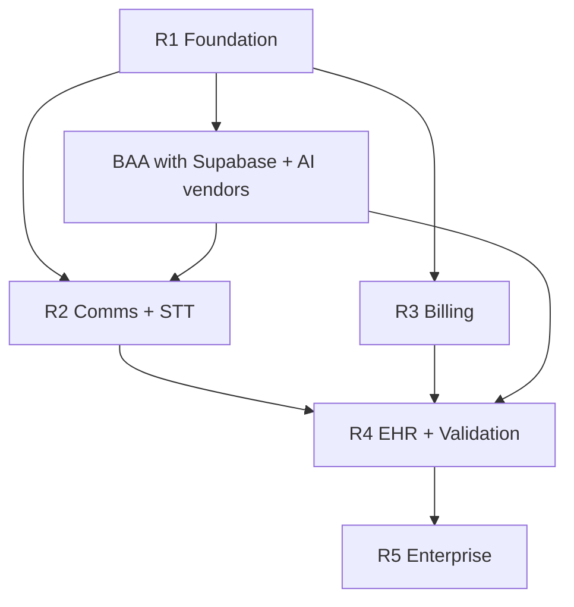

# EyeQ AI. Implementation Roadmap (Releases 1-5)

**Date:** July 6, 2026  
**Planning horizon:** ~18 months to enterprise-ready optometry platform  
**Current focus:** Release 1 (partially complete)

---

## Release overview

| Release | Theme | Target | Status (July 6, 2026) |
|---------|-------|--------|------------------------|
| **R1** | Foundation hardening | Q2 2026 | 🟡 **~70% complete** |
| **R2** | Real integrations (comms + STT) | Q3 2026 | ⚪ Not started |
| **R3** | Revenue cycle + payments | Q4 2026 | ⚪ Not started |
| **R4** | Clinical validation + EHR sync | Q1 2027 | ⚪ Not started |
| **R5** | Enterprise scale + compliance program | Q2 2027 | ⚪ Not started |

---

## Release 1. Foundation hardening

**Goal:** Safe pilot with native workflows; no false production claims.

### Completed

| Task | Evidence |
|------|----------|
| Add `Encounter` model + lifecycle actions | `prisma/schema.prisma`, `server/actions/encounters.ts` |
| Add `StaffTask` model + tasks UI | `/provider/tasks`, `server/actions/tasks.ts` |
| Define vendor adapter interfaces | `src/lib/providers/index.ts` |
| AI Gateway core (PHI gate, routing, audit) | `src/lib/ai-gateway/*` |
| Gate demo mode with `FEATURE_DEMO_MODE` | `src/lib/env.ts`, `server/actions/demo.ts` |
| Tighten API route auth (staff + org) | `/api/patients`, `/api/appointments`, `/api/imaging/*` |
| RBAC + PHI unit tests (partial) | `rbac.test.ts`, `phi-safety-gate.test.ts` (harness fix pending) |
| Legacy route redirects to `/provider/*` | `src/middleware.ts` |

### Remaining (R1 exit criteria)

| Task | Owner | Dependencies | Priority |
|------|-------|--------------|----------|
| Fix Prisma `AppointmentStatus` enum syntax | Eng | None | P0 |
| Implement `/onboarding` for new org signup | Eng | Auth, org creation action | P0 |
| Add `/forgot-password` + `/reset-password` pages | Eng | Supabase auth | P1 |
| Fix Vitest `server-only` mock for PHI tests | Eng | vitest.config | P0 |
| Migrate all AI calls through `executeAIRequest()` | Eng | Copilot, scribe note gen | P0 |
| Add permission checks to `/api/imaging/analyze` | Eng | RBAC | P1 |
| Introduce `tasks:manage` permission (replace `org:read`) | Eng | RBAC matrix update | P2 |
| Document + verify Supabase bucket policies | SecOps | Supabase project | P0 |
| Consolidate duplicate `image-quality-service` | Eng | Imaging tests | P2 |
| Production checklist sign-off | PM/Sec | All P0 above | P0 |

**R1 status:** Partially complete: core models shipped; onboarding and test harness block pilot with real tenants.

---

## Release 2. Communications + speech

**Goal:** Outbound recall and ambient scribe with BAA'd vendors.

| Task | Dependencies | Deliverable |
|------|--------------|-------------|
| Implement Twilio SMS adapter | BAA, `TWILIO_*` env | Real campaign send |
| Implement SendGrid/SES email adapter | BAA, email env | Template sends |
| Wire `approveReminderCampaign` → delivery queue | R1 audit log | End-to-end recall SMS |
| Implement Deepgram / AWS Transcribe Medical adapter | BAA, `TRANSCRIPTION_*` | Live scribe STT |
| Scribe consent capture UI hardening | Legal review | Documented consent path |
| Rate limiting on outbound comms | Vendor quotas | Abuse prevention |
| Integration tests for messaging stubs → real | R1 test harness | CI green |
| Patient opt-in sync (`CommunicationPreference`) | SMS compliance | TCPA-safe defaults |

**Exit criteria:** One production practice sends approved recall campaign via SMS; scribe session produces transcript from microphone.

---

## Release 3. Revenue cycle + payments

**Goal:** Invoice lifecycle beyond display; optional claims path.

| Task | Dependencies | Deliverable |
|------|--------------|-------------|
| Invoice CRUD server actions | `PatientInvoice` model | Create/adjust/void |
| Stripe payment adapter | BAA, `STRIPE_*` | Patient portal pay |
| Eligibility provider (Change Healthcare / Availity) | Clearinghouse contract | Eligibility check API |
| Claims clearinghouse adapter (stub → real) | CPT/ICD validation | 837 submit (pilot) |
| Fee schedule model + CPT helpers | Billing rules | Code suggestions grounded in fee schedule |
| ERA import placeholder → vendor | Clearinghouse | Payment posting |
| Billing role workflow QA | RBAC | BILLING role E2E tests |
| Hide "claims" language until submit works | GTM | Accurate marketing |

**Exit criteria:** Patient pays open invoice online; staff creates invoice from encounter checkout.

---

## Release 4. Clinical validation + EHR connectivity

**Goal:** One real EHR connector; imaging AI evaluation harness.

| Task | Dependencies | Deliverable |
|------|--------------|-------------|
| RevolutionEHR or Eyefinity read-only connector | Vendor API agreement | Patient + appointment sync |
| FHIR R4 connector implementation (replace placeholder) | OAuth vault | `EhrSyncLog` with real records |
| Bidirectional note export (pilot) | Legal + vendor | Signed note PDF/FHIR |
| pgvector + embedding pipeline | Postgres extension | Chart context retrieval |
| Imaging evaluation harness vs provider sign-offs | De-identified dataset | Metrics dashboard (internal) |
| External validated imaging model slot | FDA/regulatory decision | `ModelRegistry` enabled model |
| Multi-location report breakdown | Location filters | Per-site financials |
| DICOM / device import pipeline | Storage + metadata | OCT/VF ingest |

**Exit criteria:** Connected EHR mode syncs nightly appointments; imaging pipeline runs optional external model with documented limitations.

---

## Release 5. Enterprise + compliance program

**Goal:** SOC2-ready operations; multi-org enterprise sales.

| Task | Dependencies | Deliverable |
|------|--------------|-------------|
| SAML / OIDC SSO for staff | Identity provider | Enterprise login |
| External audit log sink (Datadog/S3) | `AUDIT_LOG_SINK=external` impl | Immutable trail |
| MFA enforcement for staff | Supabase MFA | Policy toggle |
| Session timeout + idle lock | Middleware | Configurable timeout |
| Penetration test remediation | Third-party pentest | Closed findings |
| SOC2 Type I observation | Compliance vendor | Report |
| Multi-org user membership UI | `OrganizationMembership` | Switch org |
| SLA + status page | Ops | Uptime monitoring |
| Clinical translation review workflow | `TranslationString.reviewed` | i18n QA |
| AI emergency shutdown runbook | `AI_EMERGENCY_SHUTDOWN` | Ops playbook |

**Exit criteria:** Enterprise contract with SSO, MFA, external audit, and signed BAAs across stack.

---

## Dependency graph (simplified)

---

## Cross-release workstreams

| Workstream | Releases | Notes |
|------------|----------|-------|
| **Security / HIPAA safeguards** | R1-R5 | See `HIPAA_TECHNICAL_SAFEGUARDS.md` |
| **Test coverage** | R1+ | Target 60% on server actions by R3 |
| **Documentation** | R1 | This doc set; keep `EYEQ_MASTER_STATUS.md` updated |
| **Demo vs prod** | R1 | Demo never in PHI prod |

---

## Current sprint recommendation (post-audit)

1. Fix Prisma schema + run migration  
2. Ship `/onboarding`  
3. Fix PHI Vitest suite  
4. Permission-harden imaging API  
5. Update `EYEQ_MASTER_STATUS.md` after each merge  

---

*Status percentages are engineering estimates based on codebase audit, not committed dates.*
